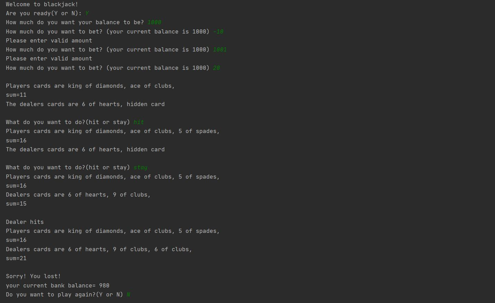

# Blackjack

This code provides a virtual interface to play a simpler version of the card game 'blackjack'. The goal of the game is to get the sum of your cards as close as possible to 21 but it should not exceed 21(method to process sum given later). When you run the program the program asks you for your name, balance and the bet amount. 

At the beginning of the game the system randomly generates two cards each for the player and dealer. One card of the dealer is hidden as per the rules of the game. After this the player has two options: hit or stay. If a player chooses to hit he recieves another card; if the player chooses to stay he doesnt get anymore cards and the dealer's turn starts. A player has his turn as long as he keeps hitting. 

When the dealer's turn starts the dealer keeps hitting till he crosses the player or the sum of his cards crosses 21. If you get defeated, you lose the amount you bet and if you win you get back the twice amount you bet. You can continue to play with varying bet amounts as long as long as you have balance.

<b>Method to process sum:</b>

Cards(2-10) have the value of the card itself.

Cards(Jack,Queen,King) have value 10

The card 'ace' can take the value 1 or 11 depending on the sum. If the overall sum exceeds 21 with ace having the value 11; the ace takes the value 1.

<b>Modules required:</b>

The modules required to run this code are Random and IPython

<b>Test run:</b>

